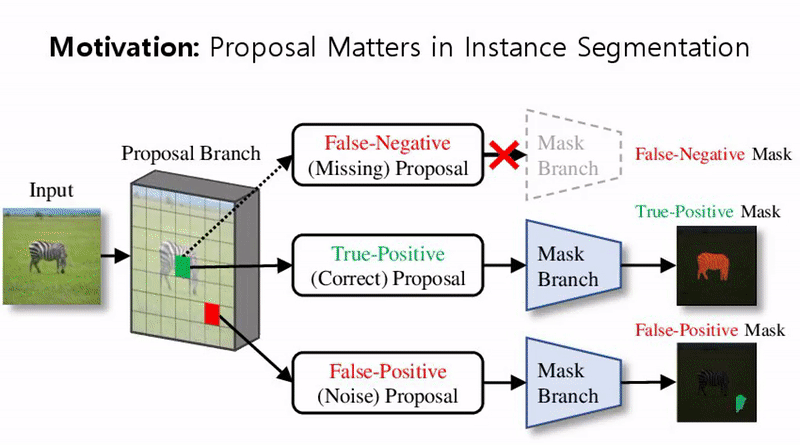
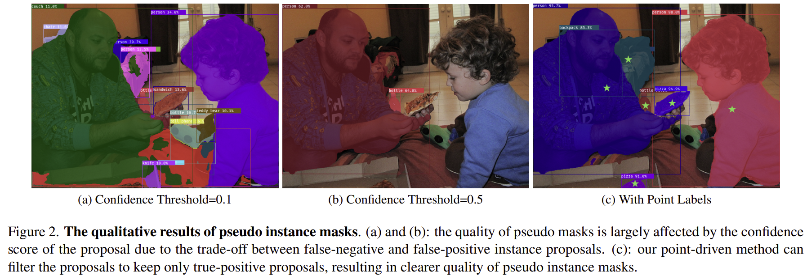
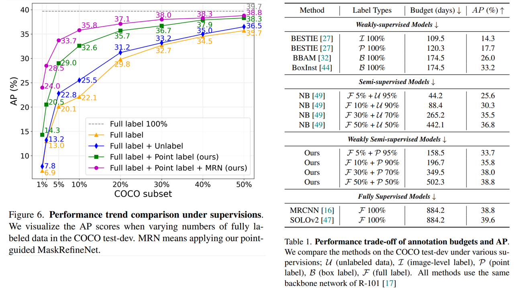

# PointWSSIS (CVPR 2023)

**The Devil is in the Points: Weakly Semi-Supervised Instance Segmentation via Point-Guided Mask Representation** <br />
[Beomyoung Kim](https://beomyoung-kim.github.io/)<sup>1,2</sup>, [Joonhyun Jeong](https://bestdeveloper691.github.io/)<sup>1,2</sup>, [Dongyoon Han](https://sites.google.com/site/dyhan0920/)<sup>3</sup>, [Sung Ju Hwang](http://www.sungjuhwang.com/)<sup>2</sup><br>

<sup>1</sup> <sub>NAVER Cloud, ImageVision</sub><br />
<sup>2</sup> <sub>KAIST</sub><br />
<sup>3</sup> <sub>NAVER AI Lab</sub><br />

[](https://cvpr.thecvf.com/Conferences/2023)
[](https://arxiv.org/abs/2303.15062)

</div>



## Introduction

We introduce a novel learning scheme named weakly semi-supervised instance segmentation (WSSIS) with point labels for budget-efficient and high-performance instance segmentation. Namely, we consider a dataset setting consisting of a few fully-labeled images and a lot of point-labeled images. Motivated by the main challenge of semi-supervised approaches mainly derives from the trade-off between false-negative and false-positive instance proposals, we propose a method for WSSIS that can effectively leverage the budget-friendly point labels as a powerful weak supervision source to resolve the challenge. Furthermore, to deal with the hard case where the amount of fully-labeled data is extremely limited, we propose a MaskRefineNet that refines noise in rough masks. We conduct extensive experiments on COCO and BDD100K datasets, and the proposed method achieves promising results comparable to those of the fully-supervised model, even with 50% of the fully labeled COCO data (38.8% vs. 39.7%). Moreover, when using as little as 5% of fully labeled COCO data, our method shows significantly superior performance over the state-of-the-art semi-supervised learning method (33.7% vs. 24.9%). 


## Updates    
**_2024-05-19_** First Commit, We release the official implementation of PointWSSIS.  


## Installation

Our implementation is based on [Detectron2](https://github.com/facebookresearch/detectron2) and [AdelaiDet](https://github.com/aim-uofa/AdelaiDet).

Please install Detectron2 and AdelaiDet in our repository (there are some modifications, [check here](https://github.com/clovaai/PointWSSIS/blob/fde68118657f59b7fa359dae7e350c42fefc00b8/AdelaiDet/adet/modeling/solov2/solov2.py#L154-L253)).

~~~
git clone https://github.com/clovaai/PointWSSIS.git

cd PointWSSIS/detectron2
python3 setup.py build develop --user

cd ../AdelaiDet
python3 setup.py build develop --user
~~~

Please check environment requirements and official guideline https://github.com/aim-uofa/AdelaiDet#installation.


## Data Preparation

For [COCO 2017 dataset](https://cocodataset.org/#download), we made subsets 1%, 2%, 5%, 10%, 20%, 30%, 50%.
- coco 5p: strong 5% + weak 95%
- coco 10p: strong 10% + weak 90%
- coco 20p: strong 20% + weak 80%
- coco 50p: strong 50% + weak 50%

All subsets are available at [google drive](https://drive.google.com/drive/folders/1g_Vzih2k-bfzu_Bt-PPsespwAh6yHFuh?usp=share_link)
- instances_train2017_{subset}_s.json : strong (fully-labeled) data subset.
- instances_train2017_{subset}_w.json : weak (point-labeled) data subset.

We also provide our pseudo labels for training the student network:
- instances_train2017_{subset}_sw.json : strong and weak (pseudo labels without MaskRefineNet) annotations
- instances_train2017_{subset}_sw_refined.json : strong and weak (pseudo labels with MaskRefineNet) annotations

~~~
data_root/
    --- coco/
        --- train2017/
        --- val2017/
        --- annotations/
            --- instances_val2017.json
            --- instances_train2017.json
            --- instances_train2017_10p_s.json
            --- instances_train2017_10p_w.json
            --- instances_train2017_10p_sw.json (optional)
            --- instances_train2017_10p_sw_refined.json (optional)
~~~

## Quick Start

1. Training teacher network using strong labels
2. Training MaskRefineNet using strong labels
3. Generating pseudo labels using weak labels
4. Training student network using strong and pseudo labels

Run all-in-one script.
~~~
bash scripts/coco_5p.sh # coco 5% scenario
bash scripts/coco_10p.sh # coco 10% scenario
bash scripts/coco_20p.sh # coco 20% scenario
bash scripts/coco_50p.sh # coco 50% scenario
~~~

## Experimental Results

|   Subset   |  Teacher Network   |    MaskRefineNet    |  Pseudo Labels | Student Network  | COCO test-dev |
| :--------: | :----------------: | :-----------------: | :--------------:  | :------:  | :------:  |
| COCO 1%    | [ckpt](https://drive.google.com/file/d/1VcjE7fiOtQc1w3seYknKMAsjDii502q4/view?usp=share_link) | [ckpt](https://drive.google.com/file/d/1xcADl8e6mxtmoBUScWvsY5NVIDfrNla8/view?usp=share_link) | [json](https://drive.google.com/file/d/1OxEaUkMpLfMrL55m1RiinANzhAQA22Zf/view?usp=share_link) | [ckpt](https://drive.google.com/file/d/1G59u3mbOn19K9-JMwr1W0uk9yDeqTwiP/view?usp=share_link) | 24.0% |
| COCO 2%    | [ckpt](https://drive.google.com/file/d/1lojspVein878DpDHQ4Y_Oxf3kD00cVLM/view?usp=share_link) | [ckpt](https://drive.google.com/file/d/1sYJxiRxdFw0buSoSAeu8LEBxycOueSgU/view?usp=share_link) | [json](https://drive.google.com/file/d/1YXT__1AHZK3AWrfoynaCLV0NJffHmn5p/view?usp=share_link) | [ckpt](https://drive.google.com/file/d/1yEF6M83ywvoRXgmLiifykUmZvErFN3FY/view?usp=share_link) | 25.3% |
| COCO 5%    | [ckpt](https://drive.google.com/file/d/1-Pxsr8j5TOir3fF7_C-TSWunG50UATEQ/view?usp=share_link) | [ckpt](https://drive.google.com/file/d/16Lz2-snZ7-pTkp_3_B-MZq4smCvmo5Pm/view?usp=share_link) | [json](https://drive.google.com/file/d/1ofYvau02EiJX_GW_gnnpw7090FD86yp-/view?usp=share_link) | [ckpt](https://drive.google.com/file/d/1T7_XgGqfYdt29wJYa4qsj5q78xp_yIXH/view?usp=share_link) | 33.7% |
| COCO 10%   | [ckpt](https://drive.google.com/file/d/1jhtvSP-6A833LFmSLfVyMij-YfvabIGs/view?usp=share_link) | [ckpt](https://drive.google.com/file/d/1o2kmVGfwoYUteAWt0rX-KxeXkmDlla6t/view?usp=share_link) | [json](https://drive.google.com/file/d/1p6gkmT-fMHbXsdsJZ6WHKttTQgBzoojW/view?usp=share_link) | [ckpt](https://drive.google.com/file/d/1wf1X3u8LIRiAtzhAXgw_53ZErtC93S8L/view?usp=share_link) | 35.8% |
| COCO 20%   | [ckpt](https://drive.google.com/file/d/1OEHE2TqFlTPZazDI3tq1xVL-AABd7a7E/view?usp=share_link) | [ckpt](https://drive.google.com/file/d/1JpvuX0uXCCvWBY6qh5mtgkryWxj8S8dA/view?usp=share_link) | [json](https://drive.google.com/file/d/14vjz5vO6e6hbw3VGsDBTe2mq01MtO_YG/view?usp=share_link) | [ckpt](https://drive.google.com/file/d/18TZhOLPqXEvsoIXZanmseHhmD7ga-a9M/view?usp=share_link) | 37.1% |
| COCO 30%   | [ckpt](https://drive.google.com/file/d/1KZ39LGHaBNwDszkJ3Mnig-nKsaqpI7qf/view?usp=share_link) | [ckpt](https://drive.google.com/file/d/14po32hg8t-rfF94YS2AZsuO5pzfFJ50X/view?usp=share_link) | [json](https://drive.google.com/file/d/16ENmSvlAZ9l5x_n2cz-viFks2nfJX5Ld/view?usp=share_link) | [ckpt](https://drive.google.com/file/d/10pzYXbj7c5S3pfyReHOBbC5EfArY-wls/view?usp=share_link) | 38.0% |
| COCO 40%   | [ckpt](https://drive.google.com/file/d/1hfve8gThJJPrDGVvLYvsCjAP0odqLSrG/view?usp=share_link) | [ckpt](https://drive.google.com/file/d/1qMtPHEeatCcR-XDu0DUCYDD_JEmr1hvY/view?usp=share_link) | [json](https://drive.google.com/file/d/1Y-3AV3ewgiZlGnNXNbCRgMx-NOopGPxS/view?usp=share_link) | [ckpt](https://drive.google.com/file/d/1UDOV36jFY8jUO6Fm9EHlfNjTmNlNO7Cp/view?usp=share_link) | 38.3% |
| COCO 50%   | [ckpt](https://drive.google.com/file/d/1zFGdtwmNasuryN8-HLjoZOO7dT-DbiX7/view?usp=share_link) | [ckpt](https://drive.google.com/file/d/1BnBAL0D_tfYeVPQZKq6Q89pq61zwQEZ0/view?usp=share_link) | [json](https://drive.google.com/file/d/1_HDayJXYmoNpbY2NYaiySzhvqAxa-B-r/view?usp=share_link) | [ckpt](https://drive.google.com/file/d/1ERPtAIYrn0S-QTtbBNZn2b58IrAO_gdb/view?usp=share_link) | 38.8% |


<div align="center">


<br />
<br />



</div>


## How to Cite
```
@article{kim2023devil,
  title={The Devil is in the Points: Weakly Semi-Supervised Instance Segmentation via Point-Guided Mask Representation},
  author={Kim, Beomyoung and Jeong, Joonhyun and Han, Dongyoon and Hwang, Sung Ju},
  journal={arXiv preprint arXiv:2303.15062},
  year={2023}
}
```

## License
```
PointWSSIS 
Copyright (c) 2023-present NAVER Cloud Corp.

Licensed under the Apache License, Version 2.0 (the "License");
you may not use this file except in compliance with the License.
You may obtain a copy of the License at

    http://www.apache.org/licenses/LICENSE-2.0

Unless required by applicable law or agreed to in writing, software
distributed under the License is distributed on an "AS IS" BASIS,
WITHOUT WARRANTIES OR CONDITIONS OF ANY KIND, either express or implied.
See the License for the specific language governing permissions and
limitations under the License.
```
